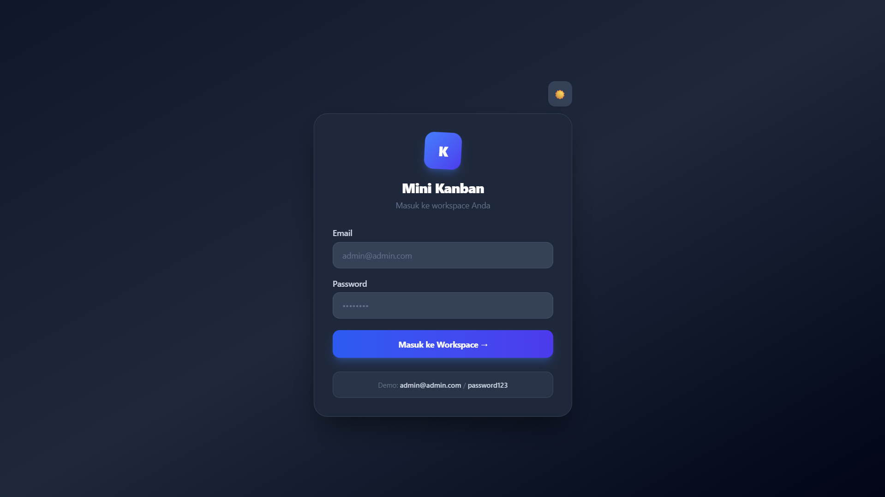
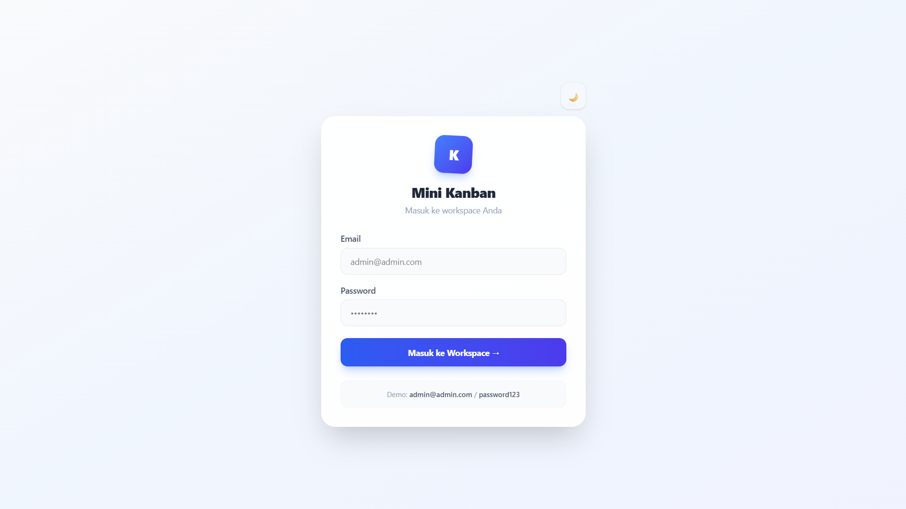
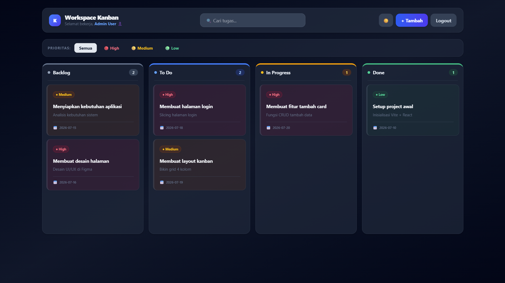
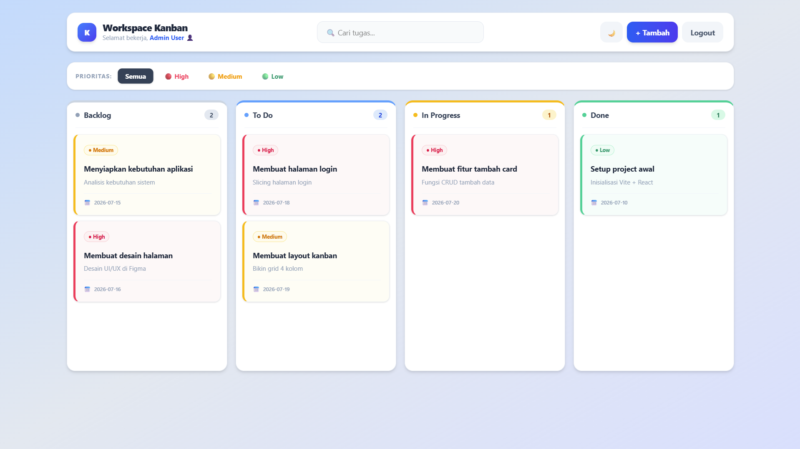
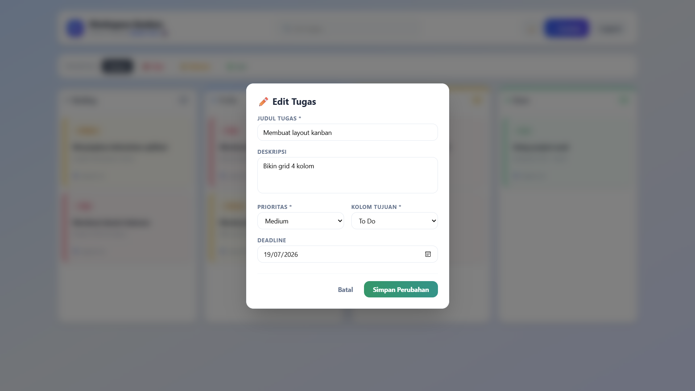
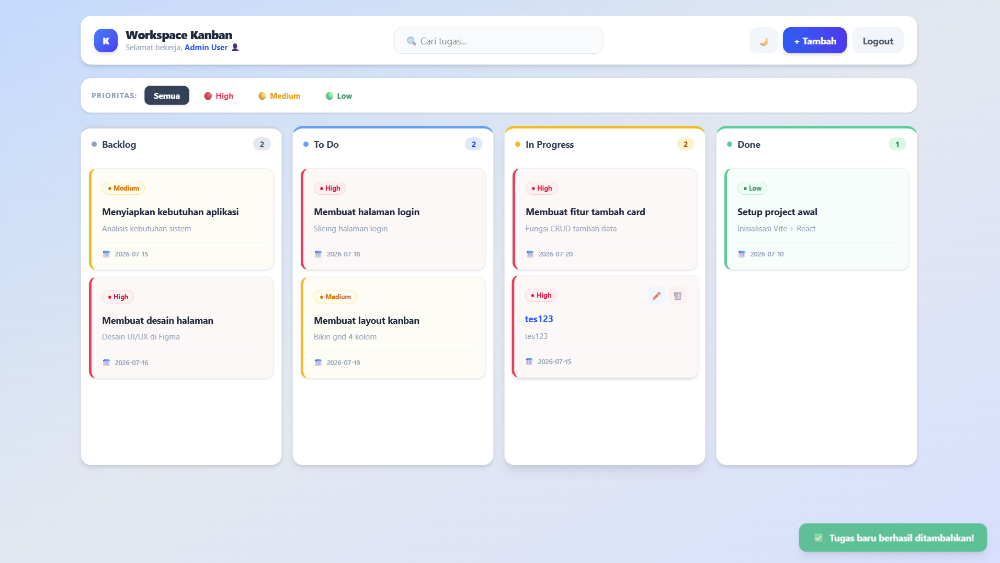
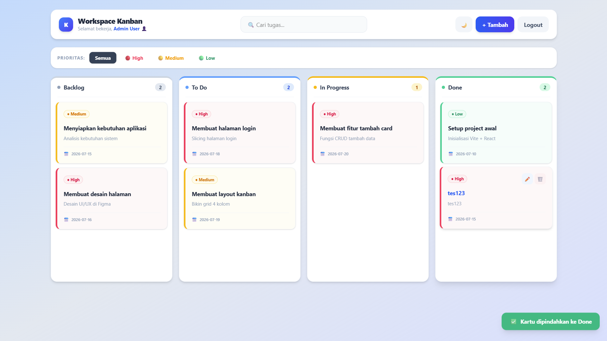
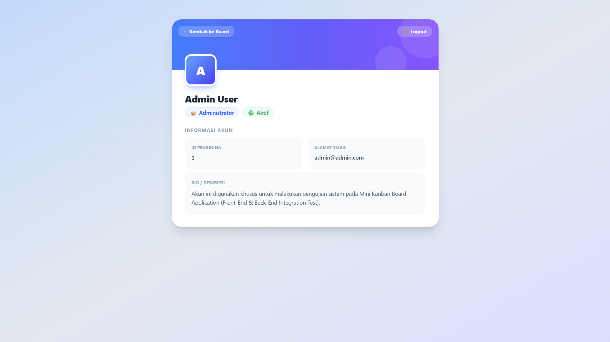

# 📋 Mini Kanban Board - Full-Stack (React & Laravel)

Aplikasi **Mini Kanban Board** ini dibuat untuk memenuhi Tes Teknis Seleksi Magang posisi **Web Developer**. Proyek ini awalnya dimulai sebagai Front-End statis namun kini telah berevolusi menjadi arsitektur **Full-Stack (Decoupled)** yang memisahkan Front-End (**React 19, Vite, Tailwind CSS v4**) dengan Back-End (**Laravel 11 REST API, MySQL**). Fokus utama proyek ini adalah kualitas visual (premium UI/UX), animasi yang halus, performa tinggi dengan *Optimistic UI*, serta pemenuhan seluruh kebutuhan fungsionalitas CRUD secara nyata (*real-time database*).

---

## 🔗 Repository Terkait
Proyek ini memisahkan arsitektur *Front-End* dan *Back-End* (Decoupled). Ini adalah repositori untuk sisi **Front-End (UI & Client-side logic)**.
* ⚙️ **Back-End Repository:** [github.com/arielreza/reza-kanban-backend](https://github.com/arielreza/reza-kanban-backend)

---

## 📸 Preview Aplikasi (Screenshots)

**1. Halaman Login (Dark & Light Mode)**
<div style="display: flex; gap: 10px;">
  
  
</div>

**2. Dashboard Utama (Kanban Board)**
<div style="display: flex; gap: 10px;">
  
  
</div>

**3. Interaksi Modal (Tambah & Edit Tugas)**
<div style="display: flex; gap: 10px;">
  
  
</div>

**4. Interaksi Tambahan (Notifikasi & Profil)**
<div style="display: flex; flex-wrap: wrap; gap: 10px;">
  
  
  
</div>

---

## 🧑‍💻 Detail Peserta
* **Nama Peserta:** Ariel Reza
* **Posisi:** Web Developer

---

## 🛠️ Teknologi yang Digunakan

### Front-End
* **Library Utama:** React 19 (Hooks, State Management, Effects)
* **Build Tool:** Vite 8 (Fast HMR & Dev Server)
* **Styling:** Tailwind CSS v4 (Native Theme Token Config)
* **HTTP Client:** Axios (untuk berinteraksi dengan API Laravel)
* **API Drag & Drop:** HTML5 Native Drag and Drop API

### Back-End (Laravel API)
* **Framework:** Laravel 11
* **Database:** MySQL
* **Autentikasi API:** Laravel Sanctum (Bearer Token)
* **Konfigurasi Tambahan:** Custom CORS configuration untuk konektivitas beda port.

---

## 🔑 Kredensial Login Demo
Aplikasi dilengkapi sistem autentikasi nyata yang diatur dari Database MySQL melalui API Laravel Sanctum.
Gunakan kredensial berikut untuk menguji:

| Peran (Role) | Email | Password |
|---|---|---|
| **Administrator** | `admin@admin.com` | `password123` |
| **Testing Member** | `user1@example.com` | `password123` |

---

## 🚀 Cara Menjalankan Project Secara Lokal

Proyek ini terbagi menjadi dua bagian (Front-End dan Back-End). Anda harus menjalankan keduanya.

### 1. Menjalankan Back-End (Laravel)
Pastikan Anda memiliki **PHP 8.2+**, **Composer**, dan **MySQL** (misalnya melalui Laragon/XAMPP) yang sudah berjalan.
1. Buka terminal dan masuk ke folder backend: `cd reza-kanban-backend`
2. Jalankan `composer install` (jika baru pertama kali).
3. Salin file environment: `cp .env.example .env`
4. Buka file `.env`, lalu pastikan pengaturan database mengarah ke MySQL Anda:
   ```env
   DB_CONNECTION=mysql
   DB_HOST=127.0.0.1
   DB_PORT=3306
   DB_DATABASE=reza_kanban_backend
   DB_USERNAME=root
   DB_PASSWORD=
   ```
5. Generate application key: `php artisan key:generate`
6. Buat database bernama `reza_kanban_backend` di MySQL Anda.
7. Jalankan migrasi dan seeder untuk membuat tabel dan mengisi dummy data:
   ```bash
   php artisan migrate:fresh --seed
   ```
8. Jalankan server lokal:
   ```bash
   php artisan serve
   ```
   *Server backend akan menyala di `http://localhost:8000`.*

### 2. Menjalankan Front-End (React)
1. Buka terminal baru dan masuk ke folder frontend: `cd reza-kanban-frontend`
2. Instal dependensi:
   ```bash
   npm install
   ```
3. Jalankan server pengembangan React:
   ```bash
   npm run dev
   ```
   *Aplikasi Front-End akan terbuka di `http://localhost:5173`.*

---

## ✨ Fitur-Fitur Utama & Nilai Tambah (Bonus)

Berikut adalah daftar fitur yang telah diimplementasikan, mencakup persyaratan dasar hingga bonus tingkat mahir:

### 1. Sistem Autentikasi API Nyata (Sanctum)
* Validasi login terhubung langsung ke Endpoint `POST /api/login` Laravel.
* Penggunaan **Bearer Token** yang disimpan di `localStorage` untuk mengamankan setiap *request* API.
* Data pengguna ditarik eksklusif sesuai dengan akun yang login (Data Isolation berdasar `user_id`).

### 2. Kanban Board Interaktif (4 Kolom Utama)
* Grid responsif untuk berbagai ukuran layar (mobile, tablet, desktop).
* Empat kolom status bawaan: **Backlog**, **To Do**, **In Progress**, dan **Done**.
* Badge penghitung jumlah tugas dan warna header indikator visual yang berbeda pada setiap kolom.

### 3. Manajemen Tugas Terintegrasi MySQL (CRUD API)
* **Create (POST):** Modal form interaktif tersambung ke database.
* **Read (GET):** Menampilkan data langsung dari MySQL setiap kali login.
* **Update (PUT):** Form pembaruan detail tugas.
* **Delete (DELETE):** Hapus tugas secara permanen dari server.

### 4. Interactive Drag & Drop + *Optimistic UI Update* (Fitur Lanjut)
* Memindahkan kartu tugas dengan digeser (*drag-and-drop*) lintas kolom secara native.
* **Optimistic UI:** Saat ditarik, kartu berpindah secara instan di layar tanpa ada jeda (*zero delay*), sementara request `PATCH` dikirim ke API di latar belakang.
* **Auto Rollback:** Jika koneksi API terputus/gagal, posisi kartu akan dibatalkan (*rollback*) secara otomatis beserta peringatan error.

### 5. Pencarian & Filter Canggih (Search & Filter)
* Pencarian teks *real-time* berbasis judul.
* **Filter Prioritas:** Tombol filter (Semua, High, Medium, Low) dengan styling atraktif. Filter dapat dikombinasikan dengan pencarian teks.

### 6. Desain Visual Premium (Day/Night Mode & Glassmorphism)
* **Mode Gelap / Terang:** Tombol toggle khusus dengan dukungan *local storage*.
* **Color Tint Prioritas:** Setiap kartu memiliki *background* lembut berdasarkan tingkat prioritas (High: Merah Muda, dsb) untuk identifikasi instan di Light maupun Dark Mode.
* **Glassmorphism:** Area header dan filter bergaya semi-transparan (backdrop blur).
* **Custom Confirm Modal & Toast Notifications:** Elemen UI kustom yang dinamis menggantikan fungsi statis browser standar.
